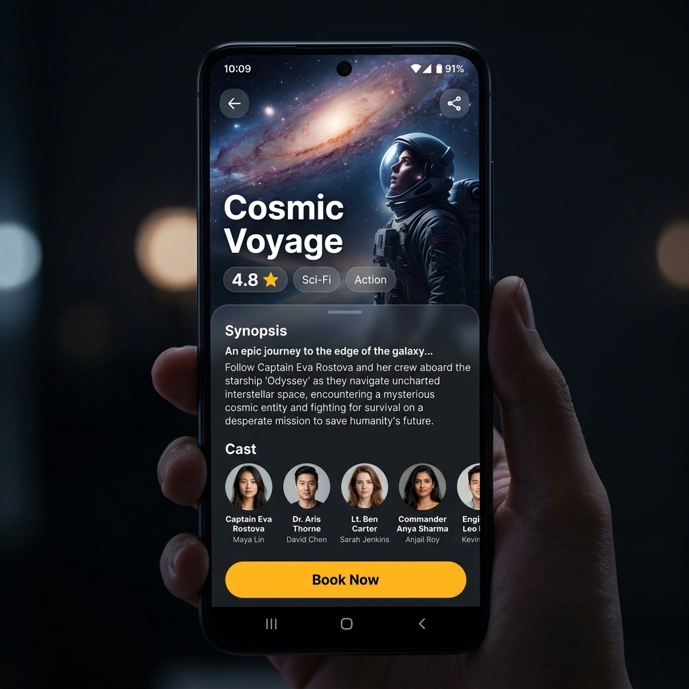
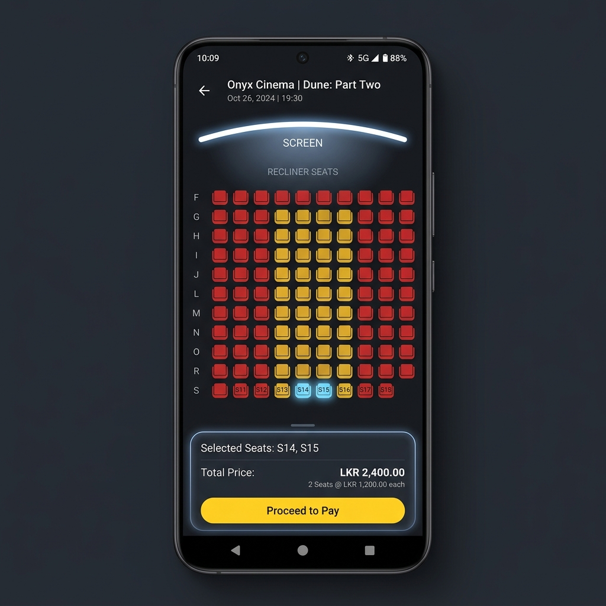

# BookMySeat 🎬🍿

A modern, feature-rich Android mobile application for seamless movie ticket booking. Built with native Android development practices, integrated with Firebase services, and powered by the PayHere payment gateway.

---

## 📱 App Showcase

Take a look at the user experience and design:

| Splash & Welcome | Movie Details | Seat Selection |
| :---: | :---: | :---: |
|  |  |  |

---

## ✨ Key Features

- **🔐 Secure Authentication:** Firebase Authentication featuring OTP (One-Time Password) verification for user onboarding.
- **📅 Event & Movie Listings:** Dynamic loading of upcoming and "coming soon" movies/events from Cloud Firestore.
- **🔍 Smart Search & Filter:** Instantly filter events by title, movie name, or venue in real-time.
- **💺 Interactive Seat Selection:** Real-time seat layout showing available (yellow), booked (red), and selected (blue) seats.
- **💳 PayHere Payment Integration:** Integrated Sri Lankan PayHere payment gateway for processing transactions in LKR.
- **🎟️ E-Tickets & QR Codes:** Generates order confirmation with unique QR codes for easy check-in verification.
- **🔔 Push Notifications:** Integrated Firebase Cloud Messaging (FCM) to send booking updates and promotions.
- **🔄 Shake to Refresh:** Utilizes the device's accelerometer sensor—simply shake your phone to reload the listings!

---

## 🛠️ Technology Stack

- **Language:** Java
- **Core SDK:** Android SDK (minSdk: 28, targetSdk: 36)
- **Database & Backend:**
  - Firebase Auth (User Authentication & OTP)
  - Cloud Firestore (Real-time NoSQL database)
  - Firebase Cloud Messaging (FCM - Push Notifications)
- **Payment Gateway:** PayHere Android SDK
- **Networking:** Retrofit & OkHttp
- **Libraries:**
  - **Glide:** Efficient image loading and caching
  - **ZXing:** Barcode/QR code scanner and generator
  - **Material Design Components:** Premium UI controls

---

## 📂 Project Structure

```
BookMySeat/
├── app/
│   ├── src/
│   │   ├── main/
│   │   │   ├── java/com/hash/bookmyseat/
│   │   │   │   ├── activity/        # App screens (Splash, Login, Home, Details, SeatSelection, Success, etc.)
│   │   │   │   ├── adapter/         # RecyclerView Adapters (Events, BookingHistory)
│   │   │   │   ├── model/           # Data models (Event, Movie, Seat, BookingHistory)
│   │   │   │   └── service/         # FCM Messaging Service & ShakeDetector sensor logic
│   │   │   └── res/
│   │   │       ├── layout/          # XML Layout definitions
│   │   │       └── values/          # Colors, Strings, Styles, and Themes
│   │   └── google-services.json     # Firebase configuration (not tracked in Git if public)
│   └── build.gradle                 # Module dependencies
├── assets/                          # App screenshots for GitHub documentation
├── build.gradle                     # Project build config
└── settings.gradle                  # Gradle settings
```

---

## 🚀 Setup & Installation

### Prerequisites
- Android Studio Ladybug (or newer)
- JDK 11
- A Firebase Project
- A PayHere Merchant Account

### 1. Clone the Repository
```bash
git clone https://github.com/YOUR_USERNAME/BookMySeat.git
```

### 2. Configure Firebase
1. Create a project on the [Firebase Console](https://console.firebase.google.com/).
2. Add an Android app with the package name `com.hash.bookmyseat`.
3. Download the `google-services.json` file.
4. Place `google-services.json` inside the `app/src/` folder of the project.
5. Enable **Phone/OTP Authentication**, **Cloud Firestore Database**, and **FCM** in your Firebase Console.

### 3. Configure PayHere Payment Gateway
In `SeatSelectionActivity.java`, update the `MERCHANT_ID` with your own PayHere Merchant ID:
```java
private static final String MERCHANT_ID = "YOUR_PAYHERE_MERCHANT_ID";
```
*Note: The code is currently set to use the PayHere Sandbox Environment (`PHConfigs.SANDBOX_URL`). For production, switch to the live environment.*

### 4. Build and Run
1. Open the project in Android Studio.
2. Let Gradle sync and download all dependencies.
3. Connect an Android device or emulator (API 28+).
4. Click the **Run** button (green play icon).

---

## 🤝 Contributing
Contributions are welcome! Please fork the repository and submit a pull request with your suggested improvements.
